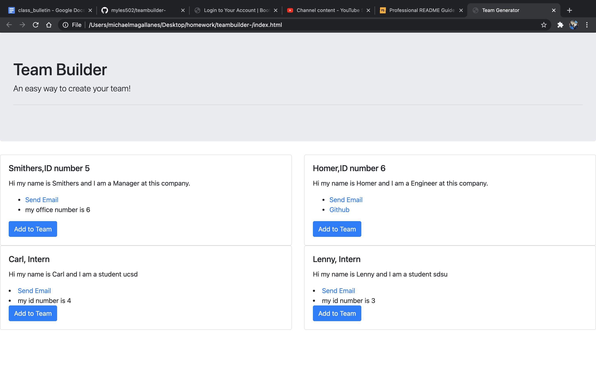

# teambuilder-
## Description

- What was your motivation? This was a project meant to organize and build teams from the command line and following prompts. 
- Why did you build this project? The primary motivation is organization and ease of use for people who want to create groups and teams. 
- What problem does it solve? It speeds up the process of organizing members of a team and getting their contact information. 
- What did you learn? I learned alot about how important psuedo code is. My regret is that I didnt spend more time planning because I could have avoided costly mistakes. 
## Table of Contents (Optional)
If your README is long, add a table of contents to make it easy for users to find what they need.
- [Installation](#installation)
- [Usage](#usage)
- [Credits](#credits)
- [License](#license)
## Installation
What are the steps required to install your project? User needs to install node- after that type node - "file name" in the command line 

## Usage
Provide instructions and examples for use. Include screenshots as needed.
To add a screenshot, create an `assets/images` folder in your repository and upload your screenshot to it. Then, using the relative filepath, add it to your README using the following syntax:
    ```md
    
    ```

## License
MIT
---
🏆 The previous sections are the bare minimum, and your project will ultimately determine the content of this document. You might also want to consider adding the following sections.
## Badges
